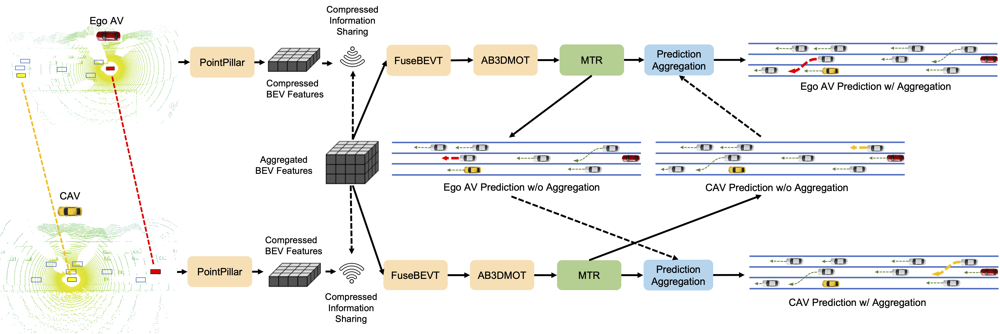

## **CMP**: **C**ooperative **M**otion **P**rediction with Multi-Agent Communication

[Paper](https://ieeexplore.ieee.org/stamp/stamp.jsp?arnumber=10908648) | [Project page](https://cmp-cooperative-prediction.github.io/) | [arXiv](https://arxiv.org/abs/2403.17916) 

This repository contains the official implementation of paper "CMP: Cooperative Motion Prediction with Multi-Agent Communication".

## Features



**1) Practical, Latency-robust Framework for Cooperative Motion Prediction**: our framwork integrates cooperative perception with trajectory prediction, marking a pioneering effort in the realm of connected and automated vehicles, which enables CAVs to share and fuse data from LiDAR point clouds to improve object detection, tracking, and motion prediction.

**2) Attention-based Prediction Aggregation**: prediction aggregator take advantage of the predictions shared by other CAVs, which improves prediction accuracy. This mechanism is scalable and can effectively handle varying numbers of CAVs.

**3) State-of-the-art Performance in cooperative prediction under practical settings on the OPV2V and V2V4Real datasets**: our framwork evaluated on both simulated V2V datasets and real world V2V scenarios, and outperforms the cooperative perception and prediction network proposed by the strongest baseline V2VNet.


## Getting Started

- [Environment Setup](docs/env.md)
- [Prepare Dataset and Checkpoints](docs/prepare_dataset_checkpoints.md)
- [Multi-Ego Perception Eval](docs/perception_eval.md)
- [Multi-Ego Prediciton Eval](docs/prediction_eval.md)
- [Visualization](docs/visualization.md)


## Visualizations

The visualizations of predicted trajectories (colored waypoints) and ground truth (black lines) under different model settings in different traffic scenarios.

### CMP


### No Cooperation


## Citation

```
@misc{wang2024cmpcooperativemotionprediction,
      title={CMP: Cooperative Motion Prediction with Multi-Agent Communication}, 
      author={Zehao Wang and Yuping Wang and Zhuoyuan Wu and Hengbo Ma and Zhaowei Li and Hang Qiu and Jiachen Li},
      year={2024},
      eprint={2403.17916},
      archivePrefix={arXiv},
      primaryClass={cs.RO},
      url={https://arxiv.org/abs/2403.17916}, 
}
```


