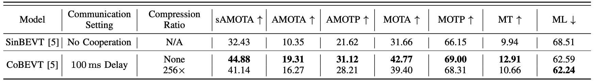

## Multi-Ego Cooperative Perception

### OPV2V 3D Object Detection

CoBEVT, 100ms Delay, no compression

```
python opencood/tools/multi_ego_inference_opv2v.py --perception_model_name corpbevtlidar_delay_1_frame_aug
```

CoBEVT, 100ms Delay, 256x compression

```
python opencood/tools/multi_ego_inference_opv2v.py --perception_model_name corpbevtlidar_delay_1_frame_aug_c256
```

V2VNet, 100ms Delay, no compression

```
python opencood/tools/multi_ego_inference_opv2v.py --perception_model_name point_pillar_v2vnet_multiego
```

No Cooperation

```
python opencood/tools/multi_ego_inference_opv2v.py --perception_model_name point_pillar_sinbevt --no_coop
```

This will save the detection and tracking results in the `preprocessed_data` folder. This script caches intermediate results in the `preprocessed_data` folder as well, so if you want to re-run, you need to delete the cache. This script also saves the fused features in the `preprocessed_data` folder. Our intermediate results can be accessed [HERE](https://drive.google.com/drive/folders/1Xqfo1FPNPlunQrj2Apnpg8NQYyXCVmQa?usp=drive_link).

The overall evaluation results will be saved in the checkpoint folder `eval.yaml`.


### V2V4Real 3D Object Detection

CoBEVT, 100ms Delay, no compression

```
python opencood/tools/multi_ego_inference_v2v4real.py --perception_model_name point_pillar_cobevt_multiego_1x
```

CoBEVT, 100ms Delay, 256x compression

```
python opencood/tools/multi_ego_inference_v2v4real.py --perception_model_name point_pillar_cobevt_multiego_256x
```

V2VNet, 100ms Delay, no compression

```
python opencood/tools/multi_ego_inference_v2v4real.py --perception_model_name point_pillar_v2vnet_multiego
```

No Cooperation

```
python opencood/tools/multi_ego_inference_v2v4real.py --perception_model_name point_pillar_sinbevt --no_coop
```


### OPV2V 3D Multi-Object Tracking

CoBEVT, 100ms Delay, no compression

```bash
python AB3Dmot/scripts/KITTI/evaluate.py --perception_model_name corpbevtlidar_delay_1_frame_aug --dataset opv2v
```

CoBEVT, 100ms Delay, 256x compression

```bash
python AB3Dmot/scripts/KITTI/evaluate.py --perception_model_name corpbevtlidar_delay_1_frame_aug_c256 --dataset opv2v
```

No Cooperation

```bash
python AB3Dmot/scripts/KITTI/evaluate.py --perception_model_name point_pillar_sinbevt --dataset opv2v
```


### V2V4Real 3D Multi-Object Tracking

CoBEVT, 100ms Delay, no compression

```bash
python AB3Dmot/scripts/KITTI/evaluate.py --perception_model_name point_pillar_cobevt_multiego_1x --dataset v2v4real
```

CoBEVT, 100ms Delay, 256x compression

```bash
python AB3Dmot/scripts/KITTI/evaluate.py --perception_model_name point_pillar_cobevt_multiego_256x --dataset v2v4real
```

No Cooperation

```bash
python AB3Dmot/scripts/KITTI/evaluate.py --perception_model_name point_pillar_sinbevt --dataset v2v4real
```

