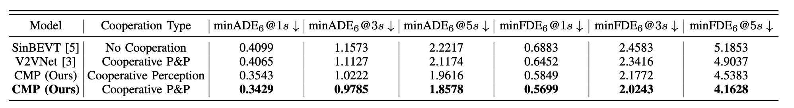
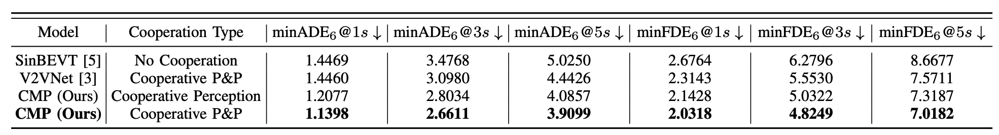

## Multi-Ego Cooperative Prediction 

Parallel Test (8GPU, batch_size is the total batch_size summed from all GPUs)

### OPV2V

CMP (ours)

```
bash MTR/tools/scripts/dist_test_multiego.sh --cfg_file MTR/tools/cfgs/opv2v/opv2v_multiego_cobevt_c256.yaml --batch_size 8 --ckpt MTR/output/opv2v_multiego_cobevt_c256/ckpt/best_model.pth --save_to_file
```

Cooperative Perception Only

```
bash MTR/tools/scripts/dist_test_multiego.sh --cfg_file MTR/tools/cfgs/opv2v/opv2v_multiego_cobevt_c256_no_agg.yaml --batch_size 8 --ckpt MTR/output/opv2v_multiego_cobevt_c256_no_agg/ckpt/best_model.pth --save_to_file
```

V2VNet

```
bash MTR/tools/scripts/dist_test_multiego.sh --cfg_file MTR/tools/cfgs/opv2v/opv2v_multiego_v2vnet.yaml --batch_size 8 --ckpt MTR/output/opv2v_multiego_v2vnet/ckpt/best_model.pth --save_to_file
```

No Cooperation

```
bash MTR/tools/scripts/dist_test_multiego.sh --cfg_file MTR/tools/cfgs/opv2v/opv2v_multiego_no_coop.yaml --batch_size 8 --ckpt MTR/output/opv2v_multiego_no_coop/ckpt/best_model.pth --save_to_file
```




### V2V4Real

CMP (ours)

```
bash MTR/tools/scripts/dist_test_multiego.sh --cfg_file MTR/tools/cfgs/v2v4real/v2v4real_multiego_cobevt_c256.yaml --batch_size 8 --ckpt MTR/output/v2v4real_multiego_cobevt_c256/ckpt/best_model.pth --save_to_file
```

Cooperative Perception Only

```
bash MTR/tools/scripts/dist_test_multiego.sh --cfg_file MTR/tools/cfgs/v2v4real/v2v4real_multiego_cobevt_c256_no_agg.yaml --batch_size 8 --ckpt MTR/output/v2v4real_multiego_cobevt_c256_no_agg/ckpt/best_model.pth --save_to_file
```

V2VNet

```
bash MTR/tools/scripts/dist_test_multiego.sh --cfg_file MTR/tools/cfgs/v2v4real/v2v4real_multiego_v2vnet.yaml --batch_size 8 --ckpt MTR/output/v2v4real_multiego_v2vnet/ckpt/best_model.pth --save_to_file
```

No Cooperation

```
bash MTR/tools/scripts/dist_test_multiego.sh --cfg_file MTR/tools/cfgs/v2v4real/v2v4real_multiego_no_coop.yaml --batch_size 8 --ckpt MTR/output/v2v4real_multiego_no_coop/ckpt/best_model.pth --save_to_file
```



